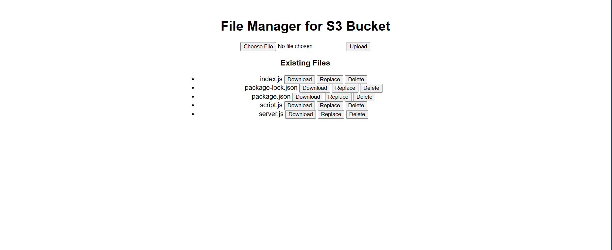

# S3 File Management Web App

This is a simple Node.js web application that allows users to upload, download, replace, and delete files from an Amazon S3 bucket. It uses the AWS SDK v3 and Express.js to interact with the S3 bucket, providing a UI for file management.

## Features

- **List Files**: View all files currently in the S3 bucket.
- **Upload Files**: Upload files directly to the S3 bucket through the UI.
- **Download Files**: Download files from the S3 bucket.
- **Replace Files**: Replace existing files in the S3 bucket with new ones.
- **Delete Files**: Delete files from the S3 bucket.

## Tech Stack

- **Frontend**: HTML, JavaScript, and Fetch API
- **Backend**: Node.js, Express.js
- **AWS SDK v3**: For interaction with S3

## Installation

### Prerequisites
- [Node.js](https://nodejs.org/en/download/) (version 12 or higher)
- An AWS account with an S3 bucket set up
- AWS credentials (access key ID and secret access key)

### Setup

1. Clone this repository:
    ```bash
    git clone https://github.com/skfawad911/s3-file-management.git
    ```

2. Navigate to the project directory:
    ```bash
    cd s3-file-management
    ```

3. Install the dependencies:
    ```bash
    npm install
    ```

4. Configure your AWS credentials:
   In the server.js, add your AWS credentials and S3 bucket information:
    ```plaintext
    AWS_ACCESS_KEY_ID=your-access-key-id
    AWS_SECRET_ACCESS_KEY=your-secret-access-key
    AWS_REGION=your-region
    BUCKET_NAME=your-s3-bucket-name
    ```

5. Run the server:
    ```bash
    node server.js
    ```

6. Open your browser and navigate to `http://localhost:3000`.

## Usage

- **Upload**: Select a file from your local machine and upload it to the S3 bucket.
- **Download**: Click the "Download" button next to any listed file to download it.
- **Replace**: Upload a new file to replace an existing file in the bucket.
- **Delete**: Delete any file from the bucket by clicking the "Delete" button.

  

## Project Structure

```plaintext
├──public
    |── index.html      # Frontend HTML file
    ├── script.js       # JavaScript for handling frontend logic
    ├── style.css       # Basic Styling   
├── server.js           # Node.js server file handling S3 interactions
└── package.json        # Node.js dependencies and scripts
 ```

## Contributing
Feel free to open issues or submit pull requests if you have suggestions for improving the project.

